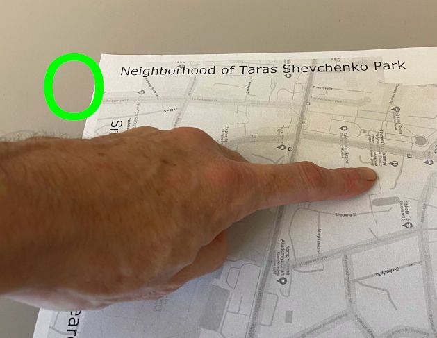
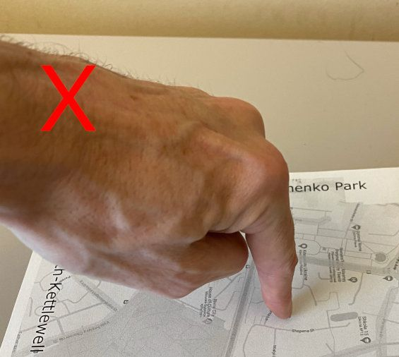

Simple CamIO 2D

Description: Simple CamIO 2D is a Python version of CamIO specialized to a flat, rectangular model such as a tactile map. This version relies on finger/hand tracking rather than the use of a stylus.

## Features

- **Hand Tracking**: MediaPipe-based hand pose detection with adaptive thresholds
- **Tap Detection**: Multi-modal tap recognition (Z-depth, angle, palm plane penetration)
- **Double-Tap Support**: Reliable double-tap detection for triggering actions
- **Spatial Audio**: Zone-based audio feedback with ambient soundscapes
- **SIFT Tracking**: Robust map tracking using SIFT/ORB feature matching
- **Threaded Architecture**: Non-blocking camera capture and display for high performance (400+ FPS)
- **Data Collection**: Automatic collection of tap detection data for classifier training
- **Headless Mode**: Run without display window - perfect for Raspberry Pi daemon deployment

## Data Collection and Classifier Training

Simple CamIO can now automatically collect tap detection data while you use the program. This allows you to train the tap classifier on your real-world usage patterns for improved accuracy!

**Quick Start:**

1. Enable in `config.py`: `TapDetectionConfig.COLLECT_TAP_DATA = True`
2. Run the program normally: `python simple_camio.py`
3. Perform taps as usual - data is collected automatically
4. Train on your data: `python tap_classifier/train_tap_classifier.py --train-from-collected --data-dir data/tap_dataset`

For detailed instructions, see [DATA_COLLECTION_GUIDE.md](tap_classifier/DATA_COLLECTION_GUIDE.md).

Requirements: To run Simple CamIO 2D, one needs to set up several things. 
- Firstly, There needs to be a json file that defines a model, that is it describes the components of an interactive map.  It contains the filenames of the various components of a model, as well as other important information such as the hotspot dictionary.  An example we recommend using as reference is `models/UkraineMap/UkraineMap.json`.

- Secondly, we require a printed map with text features along all four edges. An image of this map should be included, with its filename being specified in the element "template_image" of the model dictionary of the input json file.  We recommend using `models/UkraineMap/template.png` as an example to print out.

- Next, we require a digital version of the map that represents hotspot zones with unique indices as in `models/UkraineMap/UkraineMap.png`, and this filename should be specified in the element "filename" of the model dictionary of the input json file. Each index is a specific (R,G,B) color value. The image dimensions should match that of the template image. 

- Sound files, as named in the hotspots dictionary in the supplied json file, should be placed in the appropriate folder, as specified in the hotspots dictionary. The hotspots dictionary maps the zone index (from the zone map) to the sound file.

- Python 3.9+ installed with the required libraries specified in `requirements.txt`:
  - `mediapipe>=0.10.0,<0.11.0`
  - `numpy>=1.19.5,<1.27`
  - `scipy>=1.5.4,<2.0`
  - `opencv-contrib-python>=4.5.5.64,<5.0.0`
  - `pyglet>=1.5.0,<3.0.0`

For best performance, we recommend the camera sit above the map to get a fronto-parallel view as much as possible. The camera should have an unobstructed view of the 4 sides of the map, and the hand should be held such that the camera can clearly view it. The map should be close enough to the camera to take up most of the space in the camera image (so it is well resolved), but sufficient space (roughly 20 cm) between the map and the edges of the image should be available to ensure reliable finger/hand tracking even when the user is pointing to a feature near an edge of the map.

## Running Simple CamIO

To run with the default map (UkraineMap):
```powershell
python simple_camio.py
```

To run with a custom map:
```powershell
python simple_camio.py --input1 models/UkraineMap/UkraineMap.json
```

To run in headless mode (no display window, suitable for Raspberry Pi daemon):
```bash
# Using helper script (automatically handles display setup)
./run_headless.sh --map models/RivneMap/RivneMap.json

# Or manually with xvfb
xvfb-run python simple_camio.py --headless

# Or with DISPLAY environment variable
export DISPLAY=:0
python simple_camio.py --headless
```

**Note for Raspberry Pi:** Headless mode requires `xvfb` or a `DISPLAY` environment variable for audio support.
Install with: `sudo apt-get install xvfb`

See [RASPBERRY_PI_DAEMON.md](RASPBERRY_PI_DAEMON.md) for detailed instructions on running as a Linux daemon/service.

### Keyboard Controls

While running:
- Press **`h`** to manually re-detect the map (reset homography)
- Press **`b`** to toggle zone transition blips on/off
- Press **`q`** or **`ESC`** to quit the application

## Usage Instructions

To use, simply make a pointing gesture by extending the index finger out and curling in the other fingers.  The area on the map indicated under the tip of the index finger will be dictated aloud.  The hand should be kept flat against the surface with the finger jutting out rather than the hand being held up above the map with the finger pointed down.
 

## Installation

### Prerequisites
- Python 3.9 or higher
- A webcam or USB camera
- A printed tactile map with clear corner features

### Installation Steps

1. **Clone the repository:**
   ```powershell
   git clone https://github.com/Coughlan-Lab/simple_camio.git
   cd simple_camio
   ```

2. **Create a virtual environment (recommended):**
   ```powershell
   python -m venv venv
   venv\Scripts\activate
   ```

3. **Install dependencies:**
   ```powershell
   pip install -r requirements.txt
   ```

4. **Verify installation:**
   ```powershell
   python -c "from src.detection import CombinedPoseDetector, SIFTModelDetectorMP; print('Installation successful!')"
   ```

## Project Structure

```
simple_camio/
├── simple_camio.py           # Main entry point (clean, UI-focused)
├── requirements.txt          # Python dependencies
├── README.md                 # This file
├── ARCHITECTURE.md           # Detailed architecture documentation
├── LAUNCH_GUIDE.md          # Launch instructions
│
├── src/                     # Source code package
│   ├── __init__.py
│   ├── config.py           # Centralized configuration
│   │
│   ├── core/               # Core components
│   │   ├── utils.py        # Utility functions
│   │   ├── workers.py      # Background worker threads (Pose, SIFT, Audio)
│   │   ├── interaction_policy.py  # Zone mapping logic
│   │   ├── camera_thread.py       # Non-blocking camera capture
│   │   └── display_thread.py      # Non-blocking display rendering
│   │
│   ├── detection/          # Detection & tracking
│   │   ├── pose_detector.py      # Hand tracking and tap detection
│   │   ├── sift_detector.py      # SIFT-based map tracking
│   │   └── gesture_detection.py  # Movement filtering
│   │
│   ├── audio/              # Audio playback
│   │   └── audio.py        # Audio players
│   │
│   ├── ui/                 # User interface
│   │   └── display.py      # Drawing and overlays
│   │
│   └── tap_classifier/     # ML tap classification
│       ├── train_tap_classifier.py
│       ├── tap_classifier.py
│       ├── DATA_COLLECTION_GUIDE.md
│       └── TAP_CLASSIFIER_README.md
│
├── models/                  # Map configurations
│   ├── UkraineMap/         # Default map
│   ├── RivneMap/           # Alternative map
│   └── TestDemo/           # Demo map
│
├── data/
│   └── tap_dataset/        # Collected tap data for training
│
├── tests/                  # Unit tests (future)
│
└── legacy/                 # Legacy compatibility files
    ├── simple_camio_2d.py
    └── simple_camio_mp.py
```

## Advanced Features

### Tap Classifier Training

Train the tap classifier on synthetic data:
```powershell
python tap_classifier/train_tap_classifier.py --train --samples 1000
```

Train from your collected real-world data:
```powershell
python tap_classifier/train_tap_classifier.py --train-from-collected --data-dir data/tap_dataset
```

Evaluate the trained model:
```powershell
python tap_classifier/train_tap_classifier.py --evaluate
```

For more details, see [TAP_CLASSIFIER_README.md](tap_classifier/TAP_CLASSIFIER_README.md).

### Configuration

All tunable parameters are centralized in `src/config.py`:
- `CameraConfig` - Camera settings, processing scale, threaded capture/display options
- `TapDetectionConfig` - Tap detection thresholds and hand size scaling
- `SIFTConfig` - SIFT feature matching parameters
- `MediaPipeConfig` - MediaPipe hand tracking settings
- `AudioConfig` - Audio volume settings
- `UIConfig` - UI overlay settings
- `WorkerConfig` - Worker thread settings

**Performance Tuning:**
- Enable `USE_THREADED_CAPTURE=True` for non-blocking camera capture
- Enable `USE_THREADED_DISPLAY=True` for non-blocking display (recommended for high FPS)
- Adjust `DISPLAY_FRAME_SKIP` to control display rate (less critical with threaded display)

## Troubleshooting

**Map not detected:**
- Ensure good lighting conditions
- Check that the template image matches your physical map
- Press `h` to manually trigger re-detection
- Adjust `SIFT_CONTRAST_THRESHOLD` in `SIFTConfig`

**Taps not detected:**
- Verify your pointing gesture (flat hand, extended index finger)
- Enable debug logging: set `logging.basicConfig(level=logging.DEBUG)` in `config.py`
- Check `scale_factor` values in logs (should be 0.35-1.0)
- Try collecting real-world data and retraining the classifier

**Performance issues:**
- Enable threaded capture: `USE_THREADED_CAPTURE=True` in `CameraConfig`
- Enable threaded display: `USE_THREADED_DISPLAY=True` in `CameraConfig`
- Lower `POSE_PROCESSING_SCALE` in `CameraConfig` (default: 0.35)
- Increase `REDETECT_INTERVAL` in `SIFTConfig` (default: 150 frames)
- Reduce camera resolution

**Expected Performance:**
- With threaded capture and display enabled: 60+ FPS processing
- Main loop should run smoothly without blocking on camera or display operations

## Documentation

- [ARCHITECTURE.md](ARCHITECTURE.md) - Detailed system architecture
- [LAUNCH_GUIDE.md](LAUNCH_GUIDE.md) - Launch instructions and backward compatibility
- [.github/copilot-instructions.md](.github/copilot-instructions.md) - Developer guide for AI agents
- [tap_classifier/DATA_COLLECTION_GUIDE.md](tap_classifier/DATA_COLLECTION_GUIDE.md) - Data collection workflow
- [tap_classifier/TAP_CLASSIFIER_README.md](tap_classifier/TAP_CLASSIFIER_README.md) - Tap classifier details

__________________________________________________
## Legacy Installation Instructions

**Note:** The following instructions are for reference. Modern installation should follow the steps above.

### Old Method (Python 3.9.13)
1. Download and install Python 3.9.13 from https://www.python.org.
2. From the command line, in your working directory, type and enter "python -m venv camio"
3. Then type and enter "camio\Scripts\activate"
4. Then type and enter "git clone https://github.com/Coughlan-Lab/simple_camio.git"
5. Then type and enter "cd simple_camio" followed by "git fetch"
6. Then type and enter "pip install -r requirements.txt"

## Contributing

Contributions are welcome! Please see the developer documentation in `.github/copilot-instructions.md` for coding conventions and architecture details.

## License

See repository for license information.

## Citation

If you use Simple CamIO in your research, please cite the appropriate papers from the Coughlan Lab.
